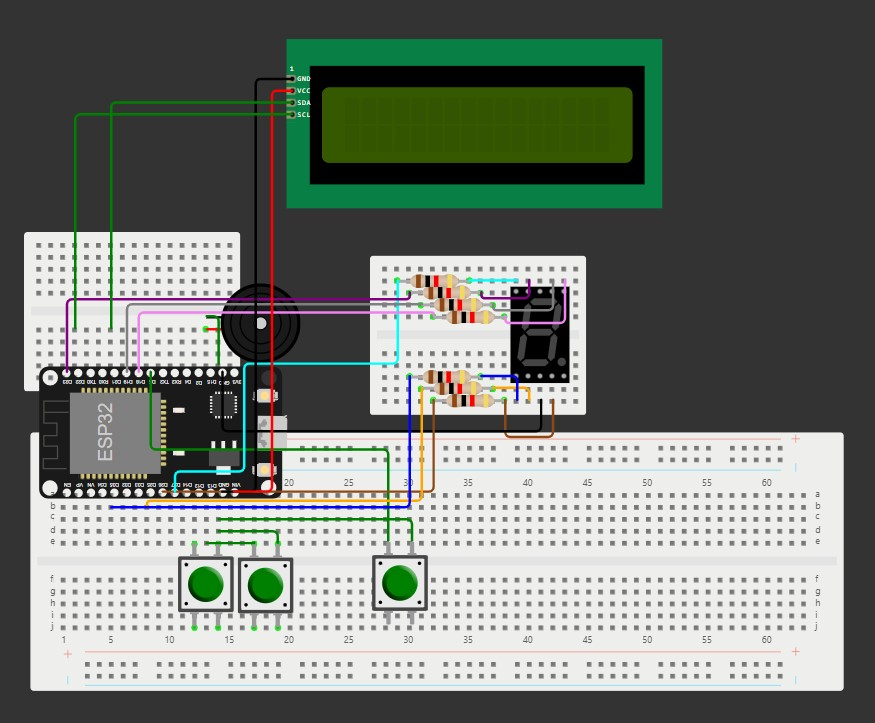

# 🎯 **Target Strike: Adaptive LED Reaction Game**

## 🚀 **Overview**
**Target Strike** is an exciting embedded system project designed to test and enhance reaction skills! Players interact with an LCD menu to set difficulty levels and modes, while LED targets light up randomly. The game is fun, fast-paced, and features **transmitter-receiver functionality** for wireless play. Compete solo or in a two-player mode with real-time score tracking and winner announcements. Let the competition begin! 🏆

---

## 🤝 **Contributors**

As part of the **EC6020_Embedded System and Design** module, this project was developed collaboratively by our group members:  

- **Indrajith E.M.I.** - 2021/E/035  
- **Weerathunga I.S.L.** - 2021/E/055  
- **Koswaththa A.D.** - 2021/E/020  
- **Jayasinghe R.R.G.I.S.** - 2021/E/122  
- **Kasuhalya K.A.P.T.** - 2021/E/070  

---
## ✨ **Features**
- 🔧 **Difficulty Levels**:  
  - 🟢 **Easy**: Targets stay on for 6 seconds.  
  - 🟡 **Medium**: Targets stay on for 4 seconds.  
  - 🔴 **Hard**: Targets stay on for 2 seconds.  

- 🕹️ **Game Modes**:  
  - 🎮 **Single-Player Mode**: Score points by hitting LED targets before they turn off.  
  - 🤼 **Two-Player Mode**: Compete with a friend and see who scores the most. Winner is announced on the LCD!

- 🎲 **Randomized Targets**: LED targets light up randomly to challenge your reaction speed.

- 📡 **Transmitter-Receiver Functionality**:  
  Wireless communication enables remote gameplay between units or with a controller.

- ⏱️ **Real-Time Feedback**: Scores update live on the LCD, and new targets light up instantly after a hit.

---

## 🛠️ **Hardware Requirements**
1. 🖥️ **Microcontroller**: ESP32  
2. 📟 **LCD Display**: 16x2 or equivalent.  
3. 💡 **LED Targets**: For interactive hit zones.  
4. 🔘 **Push Buttons**: For player inputs and menu navigation.  
5. 📡 **Wireless Transmitter & Receiver**: NRF24L01, HC-12, or Bluetooth module.  
6. 🔋 **Power Supply**: Battery or USB power.  
7. 🧰 **Additional Components**: Resistors, jumper wires, breadboard, etc.

---

## 🖼️ Circuit Diagram

Below is the circuit diagram for **Target Strike**:

---

## 🎮 **How It Works**
1. **Game Initialization**:  
   - Players use buttons and the LCD menu to select difficulty and game mode.  

2. **Gameplay**:  
   - An LED target lights up randomly.  
   - Players press the button corresponding to the target before it turns off.  

3. **Scoring System**:  
   - ✅ **Single-Player**: Score increases for each successful hit.  
   - ✅ **Two-Player**: Scores are saved and compared at the end to announce the winner.

4. **Game End**:  
   - The game concludes after a preset number of rounds or a time limit.  
   - In Two-Player Mode, the winner is displayed on the LCD! 🏆

---

## ⚙️ **Setup and Installation**
1. **Hardware Assembly**:  
   - Connect LEDs, buttons, and the LCD to the microcontroller as per the wiring diagram.  
   - Set up the transmitter and receiver for wireless functionality.  

2. **Software Installation**:  
   - Download and install the required libraries in the Arduino IDE.  
   - Upload the provided code to the microcontroller.  

3. **Start Playing**:  
   - Power up the system, choose the mode and difficulty, and get ready to play! 🎉

---

## 📈 **Future Enhancements**
- 🔊 **Sound Feedback**: Add buzzers for hits and misses for a more immersive experience.  
- 📱 **Mobile Integration**: Use a smartphone app for score tracking or remote control.  
- 🎭 **Advanced Gameplay**: Introduce multi-LED patterns for higher difficulty.  
- 🌍 **Leaderboard System**: Save high scores for competitive tracking.  

---

🎉 **Let the games begin! May the best player win! 🏆**
